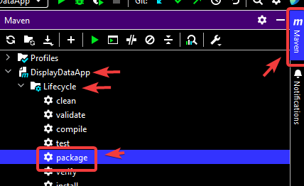

# Simple web application
# How the application works
1. Database schema and test data are loaded with Liquibase
2. The application connects to the database
3. Executes a simple query that returns a list of projects that are placed in a multi-select drop-down list
4. The user can search for keywords in the project submission history (supports any number of keywords)
5. Returns a list of searched results in an html file that is saved (in root directory) and opened in the browser (MS Edge is required to open the file automatically)

# Screenshots
1. Application window

2. Search results example

# Used:
Java, Thymeleaf, Spring Boot, H2 database, Liquibase

# How to start:
Pull into IDE.

# REST Controllers
For test purpose:  
ProjectRestController has endpoint: http://localhost:8080/api/projects  
Returns a list of projects.   

HistoryRestController has endpoint: http://localhost:8080/api/ticket-history  
Returns Example search results for the company: Stiedemann, Reilly and Raynor and the keyword: xyz.   

# Package to .JAR file
1. In pom.xml in build tag add <finalName>SearchInDatabase</finalName>
2. Exclude files: HistoryRestController.java and ProjectRestController.java (they are not needed)
3. Create .JAR package using IntelliJ Community Edition  

4. Create SearchInDatabase.bat file in directory with .JAR file containing:  
<code>
@echo off  
start "SearchInDatabase" cmd /c "java -jar SearchInDatabase.jar"  
timeout /t 10 >nul  
start "" http://localhost:8080/ticket-history-app
</code>
5. Run application using .bat file  
